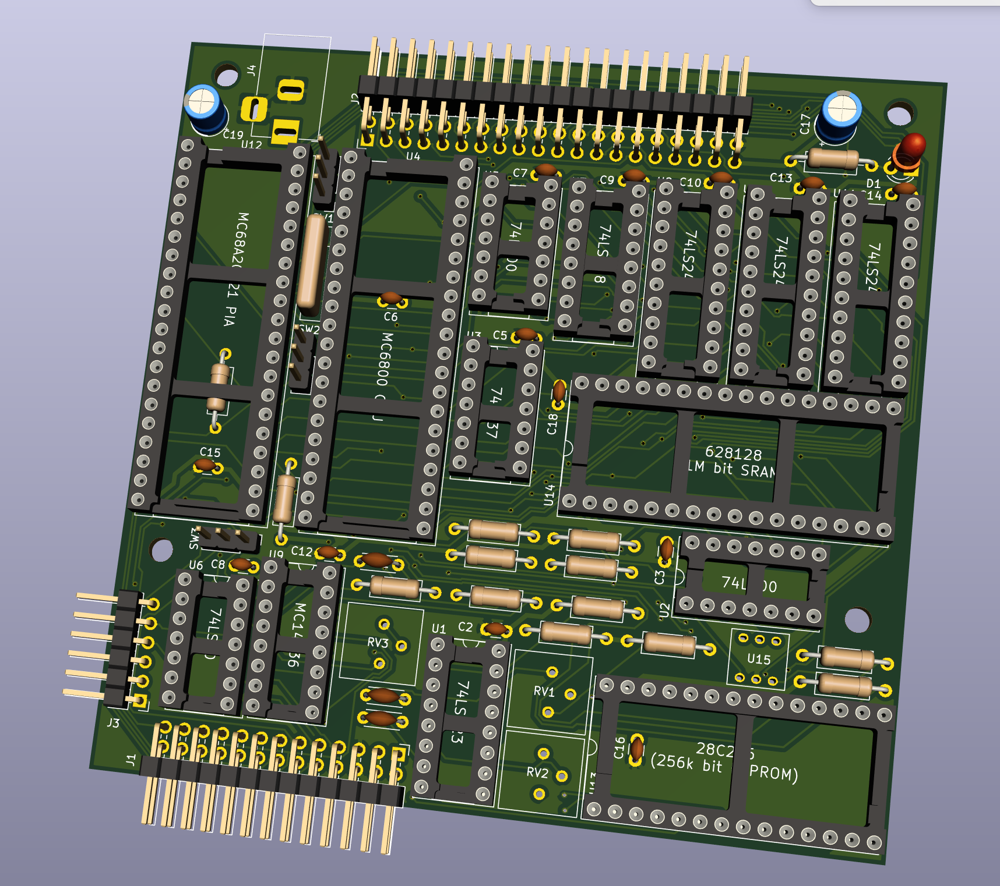

# K68-CPUB

## 注意!! 本基板は、現在動作確認中です。(2021/7/25)

## 概要

* MC6800を使ったマイコンボードです。
  * MIKBUGオリジナルROMで動きます。
  * PIA MC6821/20をつかったシリアル通信が可能で、300bpsです。
* 10cm x 10cm サイズのプリント基板データがあります。基板固定穴は秋月電子Bサイズユニバーサル基板に合わせてあります。

## 部品・回路図など

* 部品表は以下のディレクトリに入っています。
  * KiCAD/K68-CPUB_BOM/BOM.csv
* 回路図PDFは以下のディレクトリに入っています。
  * KiCAD/K68-CPUB.pdf

## 参考

* 書籍「マイコンの作り方・使い方」 啓学出版
